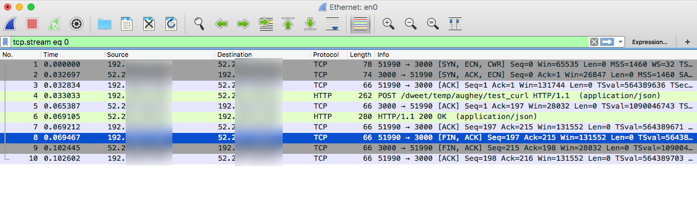
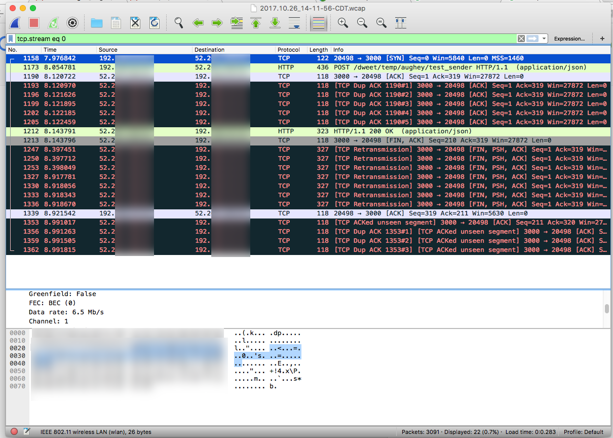

# esp32_tcp_issue

This is to document the TCP issue with the esp32 through a TP-LINK WiFi router.  The issue thread is https://github.com/espressif/esp-idf/issues/1126.

## Raspberry PI Wireshark Capture

Below is a Wireshark capture of a Raspberry PI using CURL doing the http exchange with a node.js server on an AWS Linux server.  This could be considered the gold standard for a proper TCP exchange.

The things to note is a proper SYN, SYN/ACK, ACK exchange to setup the TCP connection.  Post the data, wait for ACKs and the http response.  And the TCP tear down sequence of FIN/ACK, and the final ACK.

## ESP32 Wireshark Capture

Below is a wireshark capture of an ESP32 doing an abbreviated http exchange with the same node.js server on an AWS Linux server.  I say abbreviated, because it doesn't bother to wait for the http reply from the server, it simply connects and sends the POST message and then tears down the connection.

This lax http protocol exchange is simply an application level issue.  The TCP setup and tear down should be handled by the operating system or underlying TCP library code.

Disclaimer: I'm assuming all the data the was exchanged is captured and shown.

The areas of concern with this capture are:

* There isn't a proper TCP setup.  It appears the ESP32 sends the post data immediately after the SYN without waiting for the SYN/ACK, ACK cycle to complete.
* What's the deal with all the data in RED?  It seems that the remote site is retransmitting the TCP setup sequence in a desperate attempt to connect properly.
* The tear down sequence is there, but is one sided compared to the first capture.

# Hypothesis

The router never sees a proper setup sequence, so it doesn't pass on the tear down sequence to the ESP32.
